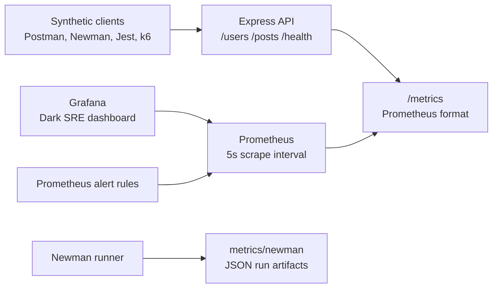

# API Testing & Monitoring Command Center

A portfolio-quality full-stack API testing and observability system that simulates a lightweight production monitoring environment for DevOps and SRE workflows.

It includes an Express API, automated Postman/Newman synthetic tests, Jest contract tests, Prometheus metrics, Grafana dashboards, Docker Compose orchestration, optional k6 load testing, alert simulation, and example historical metrics.

## Quick Start

```bash
npm install
npm run docker:up
```

Open:

- API health: [http://localhost:3000/health](http://localhost:3000/health)
- Prometheus metrics: [http://localhost:3000/metrics](http://localhost:3000/metrics)
- Prometheus UI: [http://localhost:9090](http://localhost:9090)
- Grafana: [http://localhost:3001](http://localhost:3001)

Grafana login:

- Username: `admin`
- Password: `admin`

The dashboard is provisioned automatically as **API Testing & Monitoring Command Center**.

## Architecture



## Project Structure

```text
api-observability-platform/
  api/             Express API, middleware, metrics, Dockerfile
  tests/           Jest, Newman runner, k6 stress and spike tests
  postman/         Professional Postman collection and local environment
  metrics/         Example Newman metrics and historical SLA snapshots
  grafana/         Provisioned dashboard and datasource config
  prometheus/      Scrape config and alert simulation rules
  docker/          Operational notes and future Docker overrides
```

## API Endpoints

- `GET /health` returns service health, uptime, synthetic monitoring checks, and timestamps.
- `GET /users` returns realistic user/persona data.
- `GET /posts` returns API observability knowledge posts.
- `POST /posts` validates and creates a post-like response.
- `GET /metrics` exposes Prometheus metrics.

## Metrics

The Express service exposes:

- `api_request_count`
- `api_response_time_seconds`
- `api_error_count`
- `api_uptime_seconds`
- `api_endpoint_latency_ms`
- default Node.js process metrics from `prom-client`

Prometheus scrapes the API every 5 seconds. Grafana panels use these metrics to show health, performance, and reliability trends.

## Grafana Dashboard

The dashboard uses a dark operational layout with three rows:

1. **System Health**: uptime, average latency, total requests, SLA compliance percentage.
2. **Performance**: response time trend, endpoint latency comparison, requests per second.
3. **Reliability**: error rate, failed requests, recent failures table.

Screenshot placeholders:

- `docs/screenshots/grafana-system-health.png`
- `docs/screenshots/grafana-performance.png`
- `docs/screenshots/grafana-reliability.png`

## Test Automation

Run Jest tests:

```bash
npm test
```

Run the Postman collection through Newman and save detailed JSON metrics:

```bash
npm run test:postman:metrics
```

Generated files:

- `metrics/newman/latest-run.json`
- `metrics/newman/latest-summary.json`

The normalized summary includes endpoint, method, response time, status code, timestamp, and SLA pass/fail.

## Postman SLA Coverage

The Postman collection validates:

- status codes
- response schemas
- response time SLA: `Response time under 300ms`
- content correctness

## Load Testing

Install k6 locally, then run:

```bash
npm run load:stress
npm run load:spike
```

The tests hit real endpoints, so Prometheus and Grafana will show the traffic burst, latency movement, and any reliability changes.

## Alert Simulation

Prometheus loads alert rules from `prometheus/alerts.yml`:

- `HighApiLatency`
- `ElevatedErrorRate`
- `ApiTargetDown`

These are intentionally practical portfolio alerts that map to the Grafana panels.

## Docker

Start the complete local stack:

```bash
docker compose up --build
```

Stop it:

```bash
docker compose down
```

## CI/CD

The GitHub Actions workflow in `.github/workflows/ci.yml` runs:

- dependency installation
- Jest contract and metrics tests
- Docker Compose smoke test
- `/health` and `/metrics` verification

## Local Development Without Docker

```bash
npm install
npm run dev
```

Then run:

```bash
npm test
npm run test:postman:metrics
```

Prometheus and Grafana are easiest through Docker Compose.
